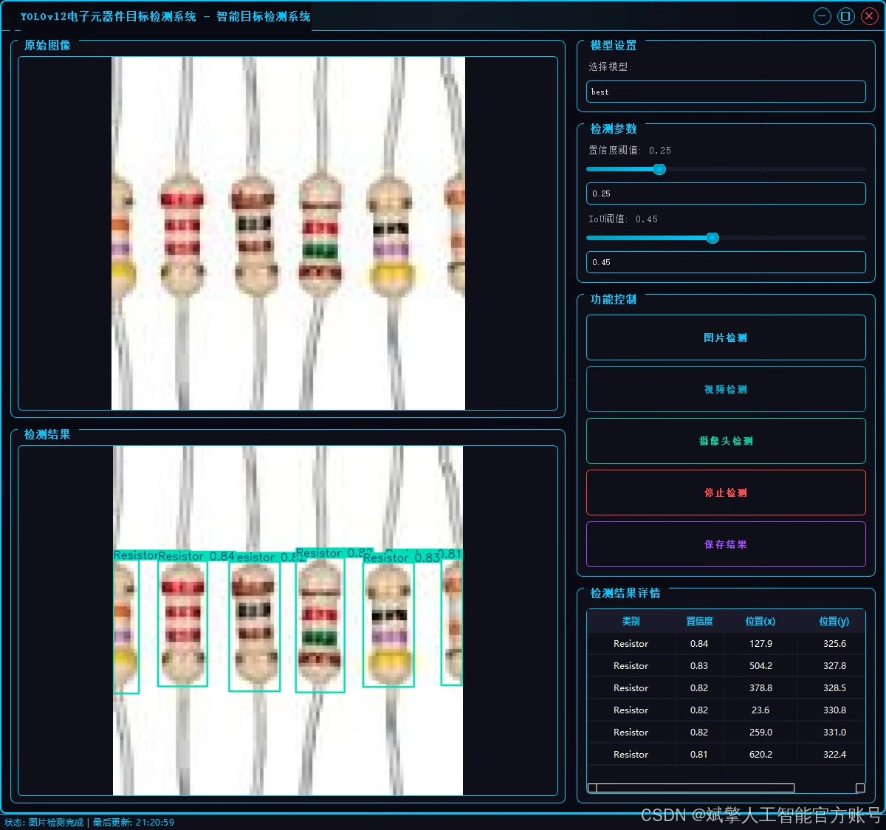
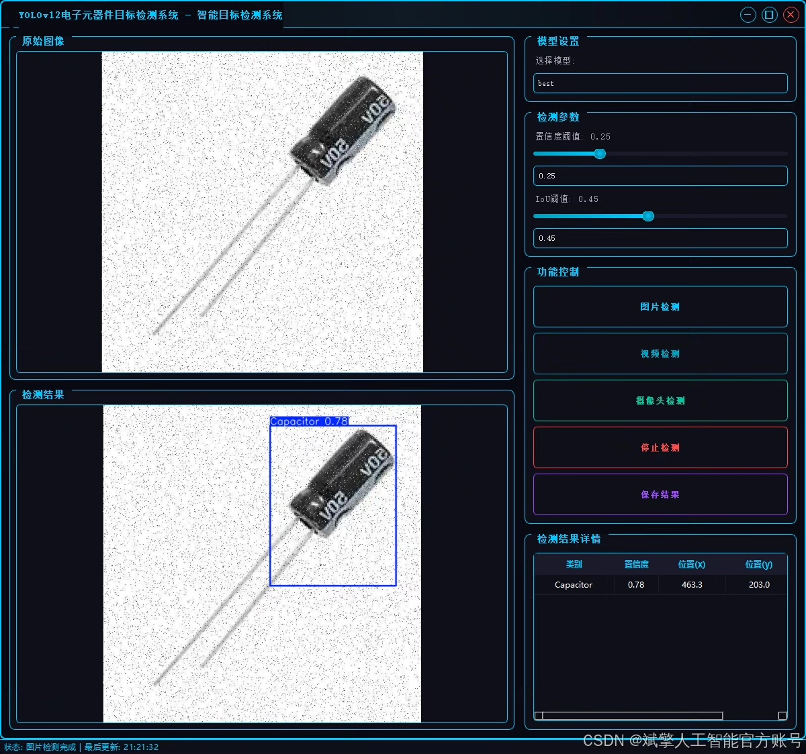
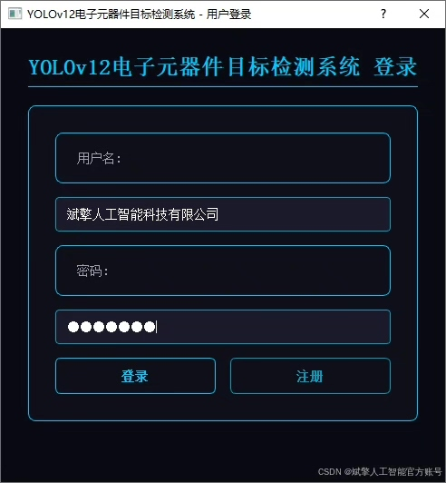
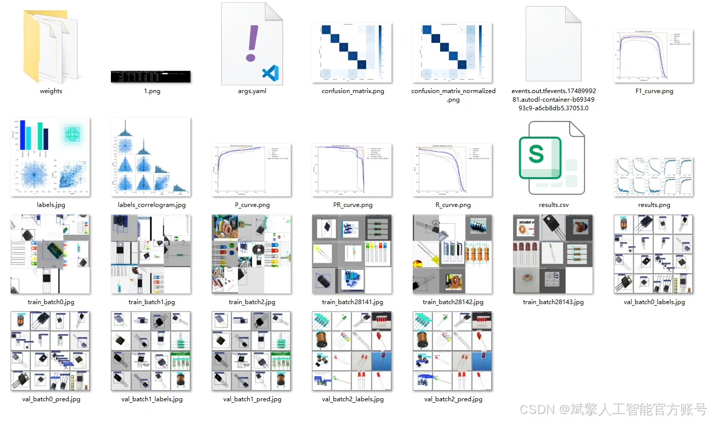
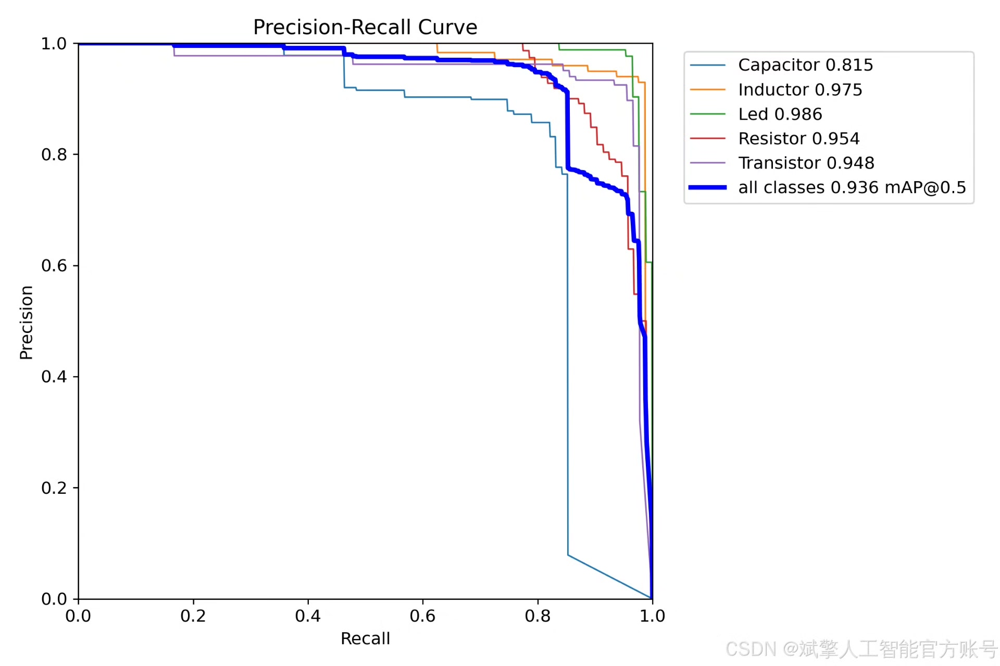
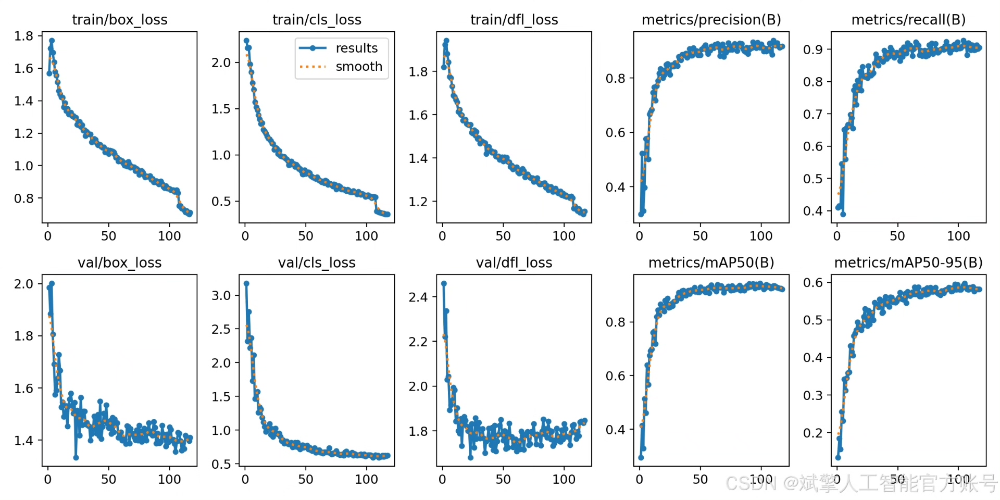
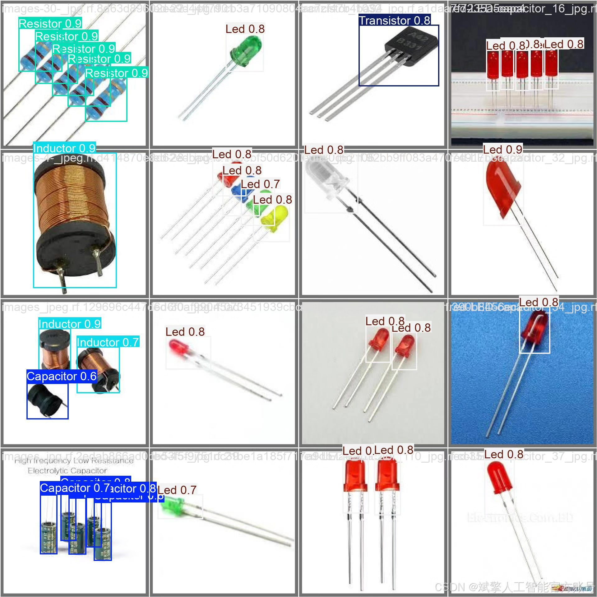

# YOLOv12 Vision Object Detection System

## Body

YOLOv12 Component Recognition System Based on Deep Learning YOLOv12: An Automated Electronic Component Recognition and Detection System (YOLOv12+YOLO dataset + UI interface + login/registration interface + Python project source code + model)

This paper designs and implements a real-time electronic component recognition and detection system based on the YOLOv12 deep learning algorithm. It supports the detection of five categories of targets: capacitors (Capacitor), inductors (Inductor), LEDs (Led), resistors (Resistor), and transistors (Transistor). The system is developed using Python, integrating a user-friendly UI interface and login/registration functions, and is optimized based on the YOLO format dataset (training set 2103 images, validation set 226 images, test set 97 images). Experiments show that this system achieves high-precision detection on the test set, providing an efficient solution for electronic component classification, inventory management, and circuit board quality inspection scenarios. The project provides open-source complete code, pre-trained models, and datasets to aid the development of intelligent industrial detection.

✅ User Login/Registration: Supports password verification and security validation.
✅ Three detection modes: Based on the YOLOv12 model, supporting image, video, and real-time camera detection, with precise target recognition.
✅ Dual-screen comparison: Displaying the original scene and detection results on the same screen.
✅ Data visualization: Real-time table displaying the category, confidence, and coordinates of detected targets.
✅ Intelligent parameter adjustment: Providing a confidence slide bar to dynamically optimize detection accuracy, adapting to different scene requirements.
✅ Sci-fi style interactive interface: Dark theme combined with dynamic light effects, reducing visual fatigue and improving operational experience.

## Images

## Payment

Here is a pay link on Stripe ( https://buy.stripe.com/3cs8yP7sY87d0vu9AB ). Please contact me lonlonago@foxmail.com after funding $89, and I will send you a complete data files , thank you!

